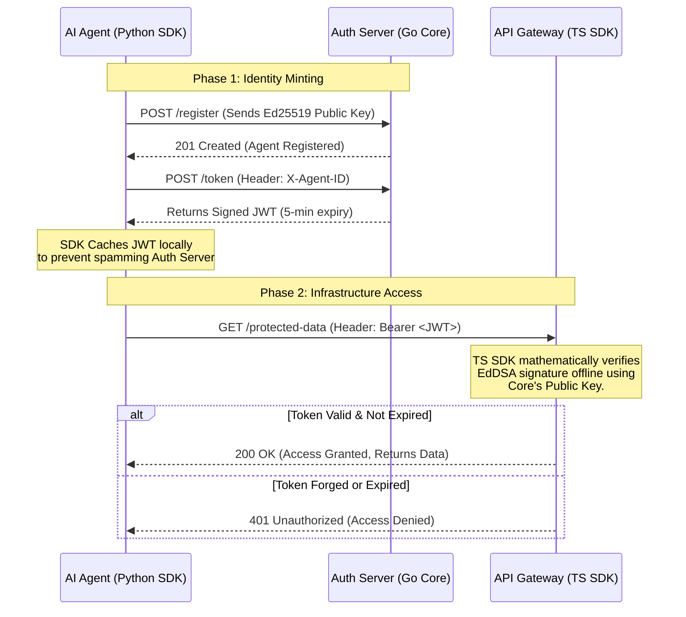

# AgentAuth-Core 🛡️

**The Identity and Access Management (IAM) layer for the Autonomous Economy.**

Human OAuth flows (redirects, browser sessions, magic links) inherently fail for autonomous AI agents. As we transition to an agentic economy, we require a purely Machine-to-Machine (M2M), highly secure, low-latency authentication protocol.

`AgentAuth-Core` is a lightweight, high-performance Go server that acts as the Identity Provider (IdP) for AI agents, leveraging Ed25519 cryptography to issue short-lived JSON Web Tokens (JWTs).

## ⚡ Core Philosophy

1. **Zero-Human Intervention:** Designed strictly for M2M interactions.
2. **Cryptographic Identity:** Agents are identified by Ed25519 keypairs, not fragile API keys.
3. **Ephemeral Access:** By default, agent JWTs expire in 5 minutes, significantly reducing the blast radius of a compromised agent.

## 🏗️ Flow



## 🚀 Quick Start

Ensure you have Go 1.21+ installed.

```bash
# Clone the repository
git clone https://github.com/agent-auth-protocol/agentauth-core.git
cd agentauth-core

# Install dependencies
go mod tidy

# Run the server
go run main.go
```

## 📖 Protocol Flow (V1)

1. **Agent Registration:** An agent generates a local Ed25519 keypair and registers its public key with the Auth Server via `POST /register`.
2. **Token Issuance:** The agent requests a session token via `POST /token`.
3. **Infrastructure Access:** The server issues a short-lived JWT. The agent uses this JWT as a Bearer token to securely interact with Model Context Protocol (MCP) servers, databases, or cloud infrastructure.

---

_Built for the Agentic Era. Part of the AgentAuth Protocol Suite._
